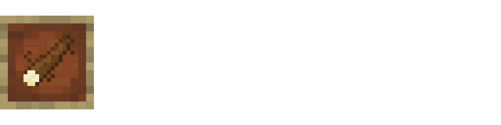

# 🌿 Cultive, colha e desfrute a mandioca no seu Minecraft 🌿 
#### Criado por tonimProgramas e Sued!

## Features

Blocos

### Bloco com buraco
Bloco obtido ao utilizar a cavadeira em qualquer tipo de terra. A cavadeira pode transforma-lo novamente em bloco terra ou bloco com mandioca plantada.

### Bloco com mandioca plantada

Pé de mandioca

O pé de mandioca é um bloco que evolui 5 estágios, ele é gerado quando um bloco com buraco é fechado com um caule de mandioca dentro. Eles podem ser quebras ou colhidos, crescem apenas de dia e são magníficos.

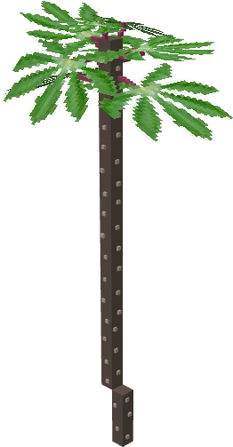
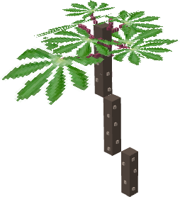
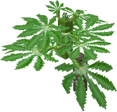
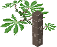
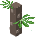

## Loot Table
### Ao quebrar:
- Estagio 0: x
- Estagio 1: 0-1 caule de mandioca.
- Estagio 2: 0-1 caule de mandioca.
- Estagio 3: 1   caule de mandioca.
- Estagio 4: 1-2 caule de mandioca.
- Estagio 5: 3-4 caule de mandioca.
### Ao colher:
- Estagio 0: x
- Estagio 1: 0-1 caule de mandioca + 1 mandioca crua.
- Estagio 2: 0-1 caule de mandioca + 2 mandiocas cruas.
- Estagio 3: 1 caule de mandioca + 3 mandiocas cruas.
- Estagio 4: 1-2 caules de mandiocas + 4 mandiocas cruas.
- Estagio 5: 3-4 caules de mandiocas + 8 mandiocas cruas.

Ferramentas

### Cavaderira
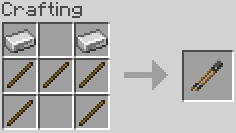

A cavadeira é uma ferramenta que cria um buraco em qualquer tipo de terra, e fecha o buraco. 
### Facão
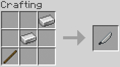

O facão descasca mandiocas cruas, este item possui validade.

Itens

### Mandioca Crua
Mandioca crua é obtida ao colher um pé de mandioca, server para ser descascado com o Facão e virar Mandioca descascada.

### Caule de Mandioca
Caules de mandioca podem ser obtidos em estruturas como villas e minas abandonadas ou colhendo um pé de mandioca. Se colocado em um buraco e fechar, um lindo pé de mandioca nascerá.

### Mandioca Ralada
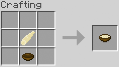

Mandioca ralada serve de craft para o bolo de mandioca aka Mané Pelado.

Comidas

### Mandioca Descascada
Uma comida que restaura 1❤, e serve de craft para mandioca ralada e mandioca cozida.
### Mandioca Cozida
### Bolo de Mandioca
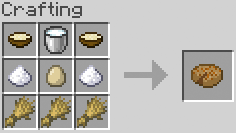

Bolo é um alimento e um bloco que pode ser comido pelo jogador.

### Tapiocas 
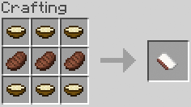 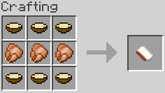

Seguem este padrão e existem também tapiocas de porco, carneiro, peixe e de coelho

# Como instalar o mod
Instale o Forge 1.20.1, depois baixer este arquivo [link do mod], e cloque ele na pasta mods.

> [!NOTE]
> Por hora o mod é valido para a versão 1.20.1.

>  