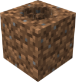
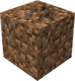
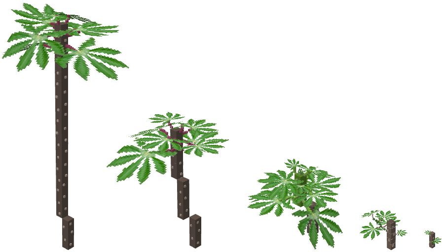
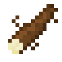
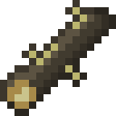

### Navegue por entre as branches para encontrar os codígos.

# 🌿 Cultive, colha e desfrute a mandioca no seu Minecraft 🌿 
#### Criado por tonimProgramas e Sued.

### Encontre um caule de mandioca por aí, coloque ele em um buraco e tampe, em pouco tempo você tera um pé de mandioca!
### Vídeo do Projeto

## Features

Blocos

### Bloco com buraco

Bloco obtido ao utilizar a cavadeira em qualquer tipo de terra. A cavadeira pode transforma-lo novamente em bloco terra ou bloco com mandioca plantada. Água os pistões o transformam em terra novamente.

### Bloco com mandioca plantada

Bloco que gera o pé de mandioca, sempre que uma mandioca é quebrada ele irá gerar outra, quando colhida o bloco volta a ser um bloco com buraco. Água os pistões o transformam em terra novamente.

Pé de mandioca

O pé de mandioca é um bloco que evolui 5 estágios, ele é gerado quando um bloco com buraco é fechado com um caule de mandioca dentro. Eles podem ser quebradis ou colhidos, crescem apenas de dia e são magníficos.

## Loot Table
### Ao quebrar:
- Estagio 0: x
- Estagio 1: 0-1 caule de mandioca.
- Estagio 2: 0-1 caule de mandioca.
- Estagio 3: 1   caule de mandioca.
- Estagio 4: 1-2 caule de mandioca.
- Estagio 5: 3-4 caule de mandioca.
### Ao colher:
- Estagio 0: x
- Estagio 1: 0-1 caule de mandioca + 1 mandioca crua.
- Estagio 2: 0-1 caule de mandioca + 2 mandiocas cruas.
- Estagio 3: 1 caule de mandioca + 3 mandiocas cruas.
- Estagio 4: 1-2 caules de mandiocas + 4 mandiocas cruas.
- Estagio 5: 3-4 caules de mandiocas + 8 mandiocas cruas.
## Tempo de Crescimento
No Minecraft, o crescimento de crops é influenciado pelos random ticks, que ocorrem em média a cada 47,30seg quando o valor do RandomTickSpeed é 3 (default). A mandioca tem 3,85% de chance de crescer a cada random tick, o que leva em média 21,4min, o que é quase equivalente a 1 dia no Minecraft.

Ferramentas

### Cavaderira

A Cavadeira é uma ferramenta que ao tê-la em mãos e clicar com o botão direito cria um buraco em qualquer tipo de terra, também  fecha o buraco. 
### Facão

O Facão descasca Mandiocas cruas em qualquer ordem dentro de qualquer tipo de crafting (2x2 ou 3x3), este item possui validade.

Itens

### Mandioca Crua

Mandioca crua é obtida ao colher um pé de mandioca, serve para ser descascada com o Facão e virar Mandioca descascada.

### Caule de Mandioca

Caules de mandioca podem ser obtidos em estruturas como vilas e minas abandonadas ou colhendo um pé de mandioca. Se colocado em um buraco e fechar, um lindo pé de mandioca nascerá.

### Mandioca Ralada

Mandioca ralada serve de craft para o bolo de mandioca aka Mané Pelado e tapiocas.

Comidas

### Mandioca Descascada

Uma comida que restaura 1🍗 de fome, e serve de craft para Mandioca ralada e Mandioca cozida.
### Mandioca Cozida

### Bolo de Mandioca

Bolo de mandioca é um alimento e um bloco que pode ser comido pelo jogador, assim como bolo cada pedaço restaura 2🍗 de fome.

### Tapiocas 
 

São comidas que restauram 10🍗 de fome, seguem este padrão de craft e existem também tapiocas de frango, porco, carneiro, peixe e de coelho.

# Como instalar o mod
Instale o Forge 1.20.1, depois baixe o mod nesta pagina https://www.curseforge.com/minecraft/mc-mods/mod-da-mandioca, e coloque ele na pasta mods dentro da pasta .minecraft.

> [!NOTE]
> Por hora o mod é válido para as versões (1.20.1, 1.20.2) e (1.21, 1.21.1) do Minecraft.

> 
